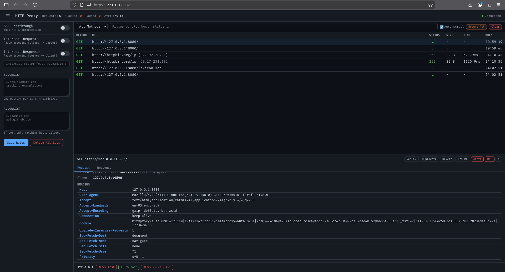

# MITM Proxy UI

An HTTP/SOCKS5 proxy with a web-based monitoring UI built on [mitmproxy](https://mitmproxy.org/).



## Features

- **HTTP and SOCKS5 proxy** on separate ports
- **Real-time request monitoring** via WebSocket
- **Intercept & edit** requests (outgoing) and responses (incoming) before they're sent
- **Replay, duplicate, revert, abort, delete** flows
- **Allowlist / blocklist** with wildcard patterns
- **SSL passthrough** mode (no cert errors, tunnels HTTPS without interception)
- **JSON syntax highlighting** in request/response body viewer
- **Original vs modified** diff view for edited flows
- **Per-host quick block/allow** from the detail panel
- **SQLite persistence** for request logs across restarts
- **Settings persistence** in `settings.json`
- Client/server IP and port tracking

## Setup

```bash
uv venv --python 3.12 .venv
source .venv/bin/activate
uv pip install -r requirements.txt
```

## Usage

```bash
python proxy.py [HTTP_PORT] [SOCKS_PORT] [WEB_PORT] [HOST]
```

Defaults: `8080 8081 8082 0.0.0.0`

```bash
# Example
python proxy.py 18080 18081 18082
```

- **HTTP proxy:** `http://localhost:18080`
- **SOCKS5 proxy:** `socks5://localhost:18081`
- **Web UI:** `http://localhost:18082`

## Testing

```bash
# HTTP proxy
curl -x http://localhost:18080 http://httpbin.org/get

# SOCKS5 proxy
curl -x socks5://localhost:18081 http://httpbin.org/ip

# HTTPS with SSL passthrough enabled
curl -x http://localhost:18080 https://httpbin.org/get
```

## Keyboard Shortcuts

| Key | Action |
|-----|--------|
| `s` | Toggle settings sidebar |
| `r` | Replay selected flow |
| `d` | Duplicate selected flow |
| `v` | Revert selected flow |
| `a` | Resume selected flow |
| `x` | Abort selected flow |
| `e` | Edit intercepted flow |
| `Esc` | Close detail panel |
| `Delete` | Delete selected flow |

## Project Structure

```
proxy.py          # Entry point, starts mitmproxy + web server
addon.py          # mitmproxy addon: logging, filtering, intercept, flow actions
web.py            # aiohttp web server: REST API + WebSocket
db.py             # SQLite persistence for request logs
static/index.html # Single-page web UI
settings.json     # Persisted settings (auto-generated)
proxy.db          # SQLite database (auto-generated)
```
